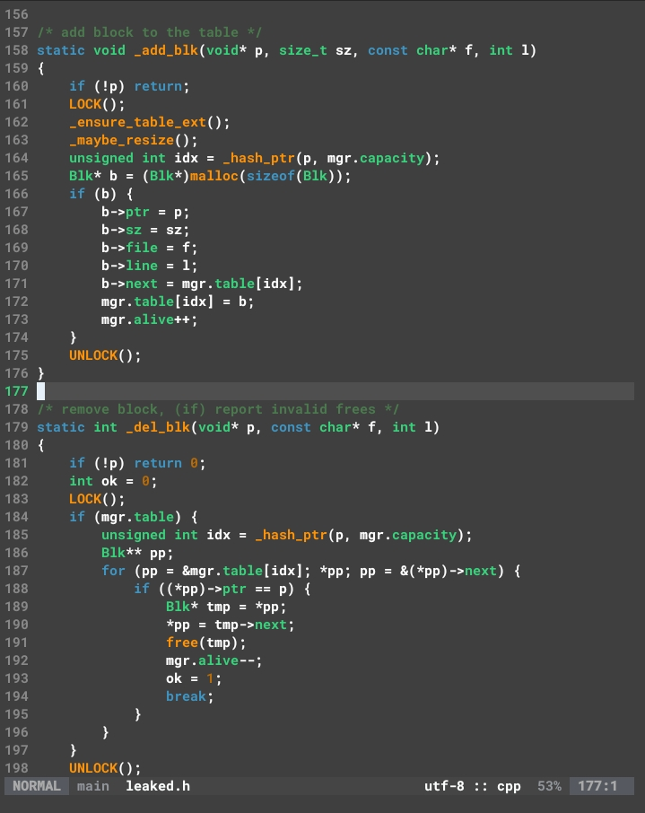
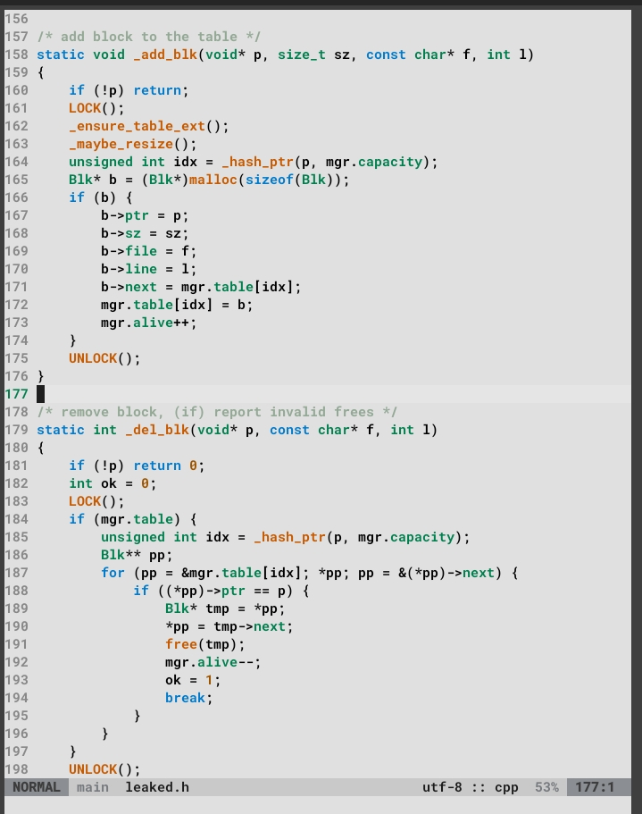
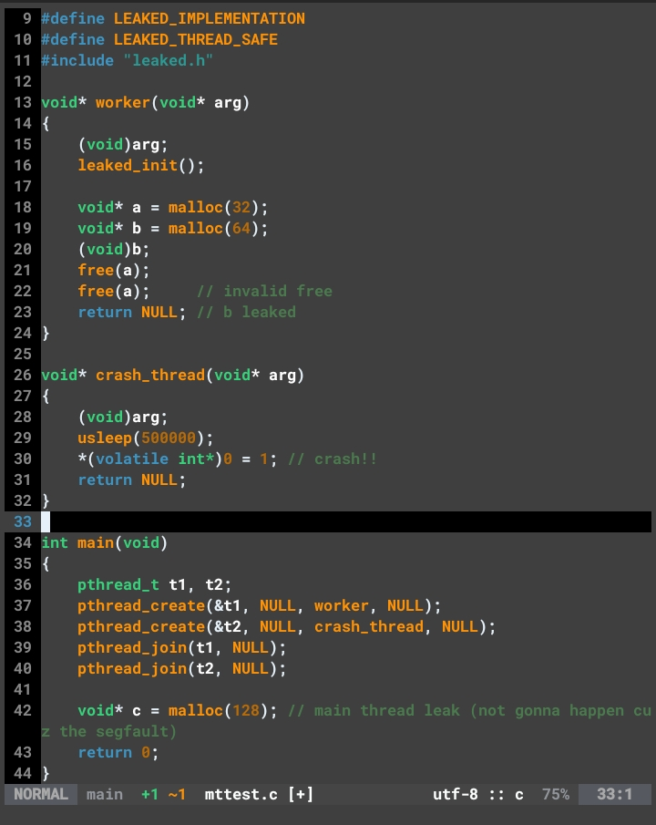
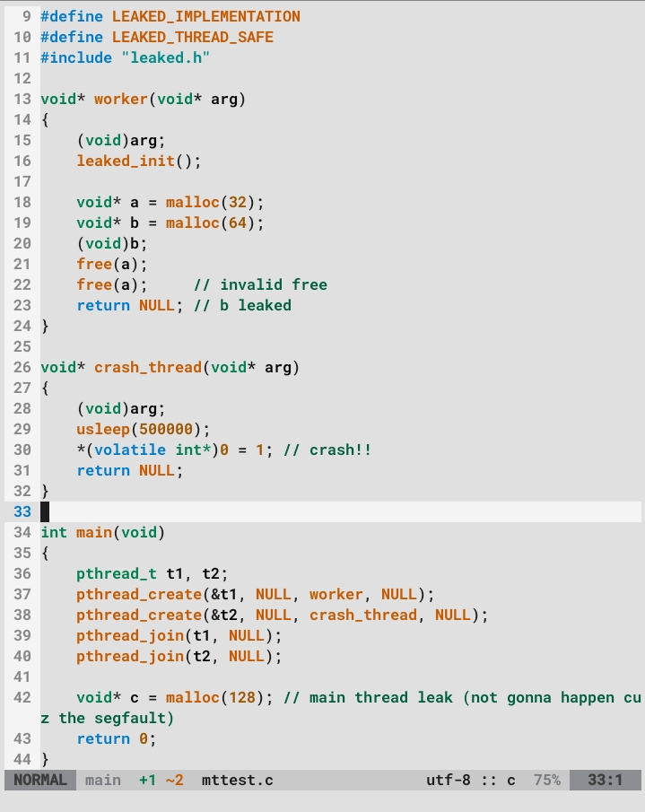

# oblique.nvim
A Neovim colorscheme with 3 varints that brings back old-school coding vibes. *(tho i learned coding 3y ago ;)*

# Version 1.99
This is the current version.

  
---



## Install the latest version (via lazy.nvim)
```lua
{
  "makestatic/oblique.nvim",
  lazy = false,
  priority = 1000,
  config = function()
    vim.cmd("colorscheme oblique")
  end
}
```

# Version 1.0
This version had a more *raw-classic—off* look. You can find it at this [commit](https://github.com/makestatic/oblique.nvim/tree/9b83569cdf8a0ae7d92c91d022ae642f0b3d0ca4), or install it (via lazy.nvim) using the code below.  *(light/dark mode).*

  
---


```lua
{
  "makestatic/oblique.nvim",
  commit = "9b83569cdf8a0ae7d92c91d022ae642f0b3d0ca4",
  lazy = false,
  priority = 1000,
  config = function()
    vim.cmd("colorscheme oblique")
  end
}
```

## Version 99


This version had a more *modern-ish* look. You can find it at this [commit](https://github.com/makestatic/oblique.nvim/tree/b6c40c0c04a756efb2ff42f4fffde352e05eac96), or install it (via lazy.nvim) using the code below.  (dark mode only).*

```lua
{
  "makestatic/oblique.nvim",
  commit = "b6c40c0c04a756efb2ff42f4fffde352e05eac96",
  lazy = false,
  priority = 1000,
  config = function()
    vim.cmd("colorscheme oblique")
  end
}
```

## Plugins supported
- Treesitter  
- Telescope  
- Cmp  
- Lualine  
- Nvim-Tree  
- Bufferline  

## TODO
- Supports more plugins

<sub>Copyright (c) 2025 Ali Almalki. Licensed under BSD-3-Clause.</sub>
