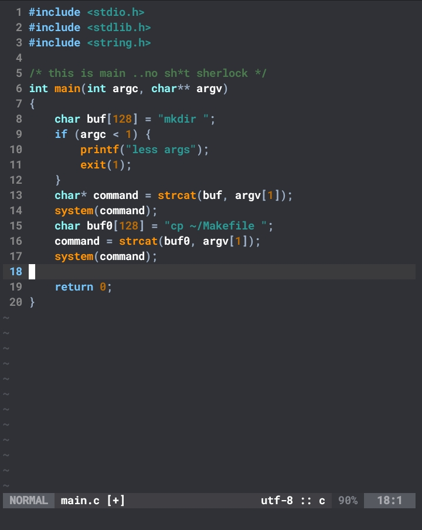

# oblique.nvim
Bring the 99s vibes to your code.



## Install (via lazy.nvim)
```lua
{
  "makestatic/oblique.nvim",
  lazy = false,
  priority = 1000,
  config = function()
    vim.cmd("colorscheme oblique")
  end
}
```

## Plugins Supported
- Telescope
- Cmp
- Lualine
- Nvim-Tree
- BufferLine

## TODO
- More plugin support

<sub>Copyright (c) 2025 Ali Almalki. Licensed under BSD-3-Clause.</sub>
